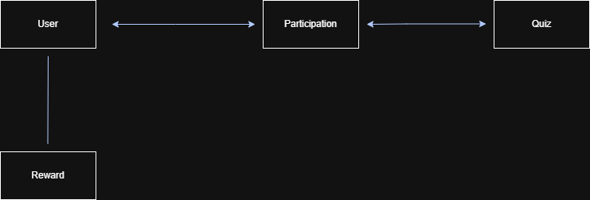
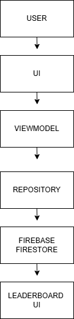

# ⏱️ TimeRush – Earn & Grow with Time

TimeRush is a Gen-Z focused reward-based mobile application that converts short, focused time into rewards and personal growth through competitive daily challenges.

## 🚀 Features
- Firebase Authentication (Login / Signup)
- Daily Quiz Challenges
- Streak-based rewards
- Real-time Global Leaderboard
- Offline-first local storage with Room
- Cloud sync using Firebase Firestore

## 🧠 Architecture
- MVVM Architecture
- Jetpack Compose UI
- Repository Pattern
- Firebase (Auth + Firestore)
- Room Database for local caching

## 📊 Architecture & Design Diagrams

### 🧩 ERD (Entity Relationship Diagram)
Shows the relationship between core entities such as User, Quiz, Participation, and Reward.

---

### 🔁 DRD (Data Relationship Diagram)
Illustrates how data flows through the system from UI to backend services.

---

### 🧍 User Journey / Flow Diagram
Represents the end-to-end journey of a user within the TimeRush application.

📄 Detailed architecture diagrams available in `/Documentation`

## 🎥 Demo Video
👉 [Watch Demo](https://drive.google.com/file/d/1cop8WDgp78S5rLOV8qJuMXJ4UerDt046/view?usp=sharing)

## 📂 Project Structure
- `ui/` → Compose screens
- `viewmodel/` → State & logic
- `repository/` → Data sources
- `data/` → Room entities & DAO
- `utils/` → Streaks, rewards, helpers

## 🧪 How to Run
1. Clone repository
2. Open in Android Studio
3. Add your `google-services.json`
4. Run on emulator or device

## 📈 Future Enhancements
- Weekly leagues
- Difficulty-based scoring
- Admin quiz panel

